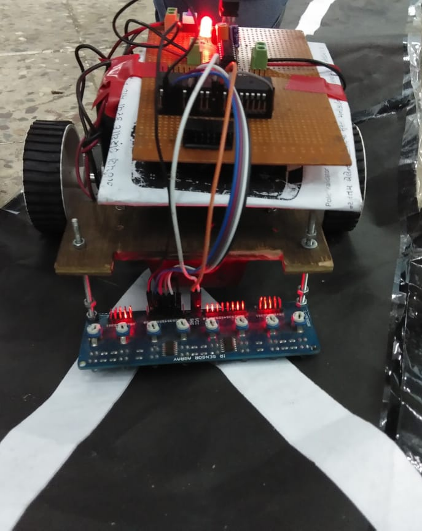

# Line Follower Robot

<p style="text-align:center">

</p>


## Overview

The Line Follower Robot is an autonomous robot designed to follow a predefined path or line on the ground. It utilizes infrared sensors to detect the contrast between the line and the surrounding surface, enabling it to make decisions and adjust its direction accordingly. This project aims to demonstrate fundamental principles of robotics, sensor integration, and autonomous navigation.

## Hardware Components

- Microcontroller: Atmega32
- Voltage Regulator: LM7805
- Motor Driver: L293D
- General Purpose PCB
- 10 pin FRC port
- USBASP programmer
- Battery (12V)
- DC Motors
- Infrared Line Sensor
- LED green and red
- Resistor(330ohm)
- Capacitor(1uf and 10uf)
- Male-Female Headers
- Jumper Wires
- Wheels
- Castor wheel
- On/off push button
- Chassis
- IC Beds

## Software Tools

- Atmel Studio
- SimulIDE_0.4.15
- ExtreamBurner (for burning the .hex file to the microcontroller)

## Installation

1. Clone or download the project repository.
    ```bash
    git clone https://github.com/tusharmalankiya/Line-Follower-Robot.git
    ```
2. Compile the code using Atmel Studio to generate the .hex file.
3. Burn the generated .hex file to the Atmega32 microcontroller using ExtreamBurner and an appropriate programming cable (e.g., FRC cable).
4. Assemble the hardware components according to the wiring diagram provided in the project documentation.
5. Power up the robot and place it on the line to start autonomous operation.

## Usage

1. Power on the Line Follower Robot.
2. Ensure that the IR sensors are correctly positioned to detect the line.
3. Adjust the speed and sensitivity settings as needed for optimal performance.
4. Place the robot on the line to initiate autonomous line following.
5. Monitor the status LEDs and serial output for diagnostics and troubleshooting.

## Demo

https://github.com/tusharmalankiya/Line-Follower-Robot/assets/85736626/e55f9d38-f96c-406a-9e31-598a2bb3ed1c

## Contributing

Contributions to this project are welcome! Feel free to submit bug reports, feature requests, or pull requests to improve the functionality or documentation of the Line Follower Robot.


## Project Structure

```bash
line_follower_robot
├── README.md
├── atmel_studio_project
│   ├── Debug
│   │   ├── Makefile
│   │   ├── atmel_studio_project.eep
│   │   ├── atmel_studio_project.elf
│   │   ├── atmel_studio_project.hex
│   │   ├── atmel_studio_project.lss
│   │   ├── atmel_studio_project.map
│   │   ├── atmel_studio_project.srec
│   │   ├── linefollower.d
│   │   ├── linefollower.o
│   │   ├── main.d
│   │   ├── main.o
│   │   └── makedep.mk
│   ├── atmel_studio_project.atsln
│   ├── atmel_studio_project.componentinfo.xml
│   ├── atmel_studio_project.cproj
│   ├── linefollower.c
│   ├── linefollower.h
│   └── main.c
├── docs
│   ├── Documentation.pdf
│   ├── datasheets
│   │   ├── Atmega32.pdf
│   │   ├── L293D.PDF
│   │   └── LM7805.PDF
│   ├── images
│   │   ├── img1.jpg
│   │   └── img2.jpeg
│   └── videos
│       └── demo.mp4
├── schematics
│   ├── line_follower_robot_schematic.jpg
│   └── simlIDE_schematic.png
├── simulIDE_simulation
│   ├── Line Follower Simulation.simu
│   ├── README.md
│   └── docs
│       └── Simulation.gif
└── source_code
    ├── linefollower.c
    ├── linefollower.h
    └── main.c
```
