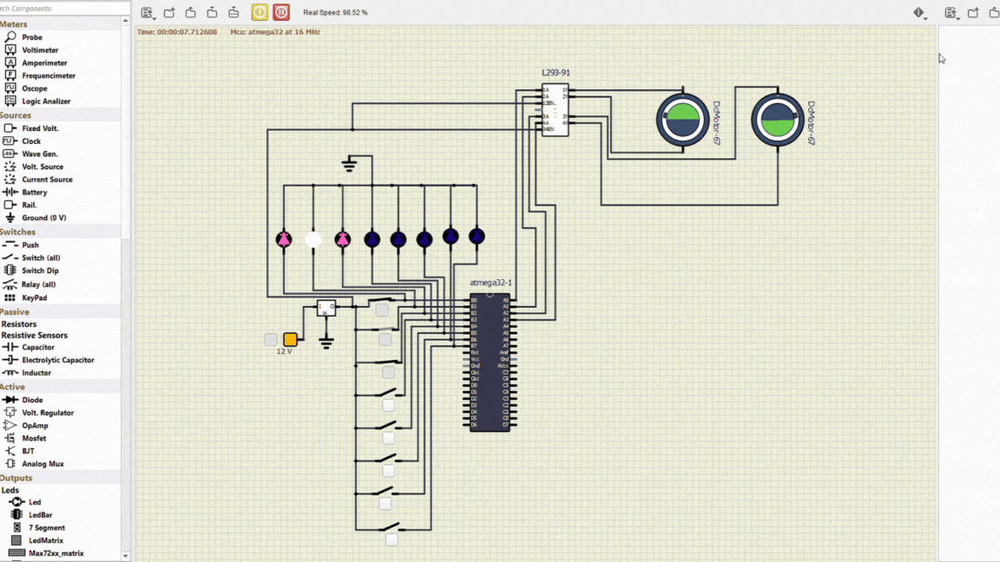

# Line Follower Simulation

This simulation replicates the behavior of a Line Follower Robot, taking input directly from a source for convenience.

## Deployment Instructions

To deploy the simulation, follow these steps:

1. **Download SimulIDE**: Download [SimulIDE_0.4.15](https://simulide.com/p/downloads/) from the official website.

2. **Open Simulation File**: Open the **Line Follower Simulation.simu** file in SimulIDE.

3. **Load Firmware**: Navigate to the `atmel_studio_project` > `Debug` directory and locate the firmware file with the `.hex` extension. In SimulIDE, find the option to load firmware and select the `.hex` file.

4. **Run Simulation**: Once the firmware is loaded, run the simulation to observe the behavior of the line follower robot.

## Troubleshooting

If you encounter any issues during deployment, consider the following troubleshooting tips:

- Make sure that SimulIDE is correctly installed, ensuring that the version is `0.4.15`.
- Double-check that the firmware file is correctly loaded into the simulation.
- Refer to the SimulIDE documentation or community forums for additional assistance.

